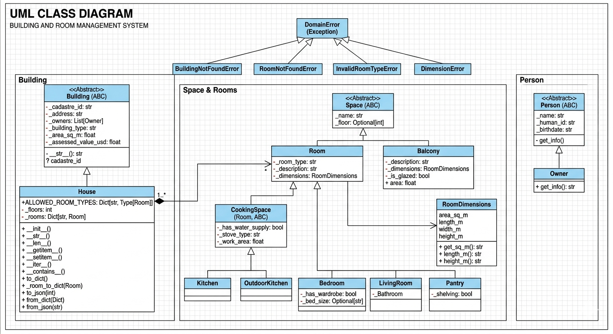

# Реализация кода из main.py

# UML-диаграмма

## Комментарии к сложным участкам кода

Ниже пояснения к местам, где чаще всего возникают вопросы по логике.

### 1) Валидация через `@property` (инкапсуляция)

- В `Worker.age`, `Worker.experience_years`, `Worker.projects_completed`, `Worker.base_rate` проверки выполняются **в
  сеттерах**, а не в `__init__`.
- Это сделано, чтобы ограничения работали и при создании объекта, и при последующем изменении поля.
- Пример: если присвоить `age = 15`, сеттер сразу выбросит `ValidationError`.

### 2) Полиморфизм в зарплате

- Метод `calculate_salary()` объявлен абстрактным в `Worker` и реализован по-разному в `Architect`, `Designer`,
  `Brigadier`, `Builder`.
- За счет этого в `Team.payroll()` можно итерироваться по списку `Worker` и вызывать один и тот же метод:
  `sum(person.calculate_salary() for person in all_people)`.
- Конкретная формула выбирается автоматически по типу объекта.

### 3) Магические методы и зачем они здесь

- `Worker.__lt__`: позволяет сортировать работников (`workers.sort()`) по стажу.
- `Worker.__eq__`: сравнение работников по `id`, а не по ссылке в памяти.
- `HouseProject.__len__`: `len(project)` возвращает число людей в проекте.
- `Material.__mul__`: демонстрация перегрузки операции (масштабирование стоимости материала).

### 4) Восстановление объектов из JSON (`from_dict`)

- `ProjectRegistry.load_json()` читает массив проектов и для каждого вызывает `HouseProject.from_dict(...)`.
- Далее идет каскадное восстановление:
  `HouseProject -> BuildElement -> Structure -> MaterialGroup -> Material`
  и отдельно
  `HouseProject -> Team -> Brigade -> Worker`.
- Такой подход сохраняет связи между объектами после загрузки.

### 5) Проверка структуры JSON и защита от битых данных

- В `HouseProject.from_dict` есть список `required` и проверка `missing`.
- Если ключей не хватает, выбрасывается `JsonFormatError`, а не `KeyError`.
- Это дает более понятную бизнес-ошибку для пользователя.

### 6) Почему `ProjectRegistry` отдельным классом

- Он изолирует файловую работу (`load_json`, `save_json`) от бизнес-сущностей.
- Модели (`HouseProject`, `Team`, `Material`) отвечают за состояние и логику.
- `ProjectRegistry` отвечает за хранение коллекции и I/O.

### 7) Блок `if __name__ == "__main__"`

- `from_json_to_json()` — сценарий `JSON -> объекты -> JSON` (round-trip).
- `from_code_to_json()` — сценарий «создали объекты вручную -> сохранили JSON».
- Обе ветки обернуты в `try/except ProjectSystemError`, чтобы показывать контролируемые ошибки домена.
