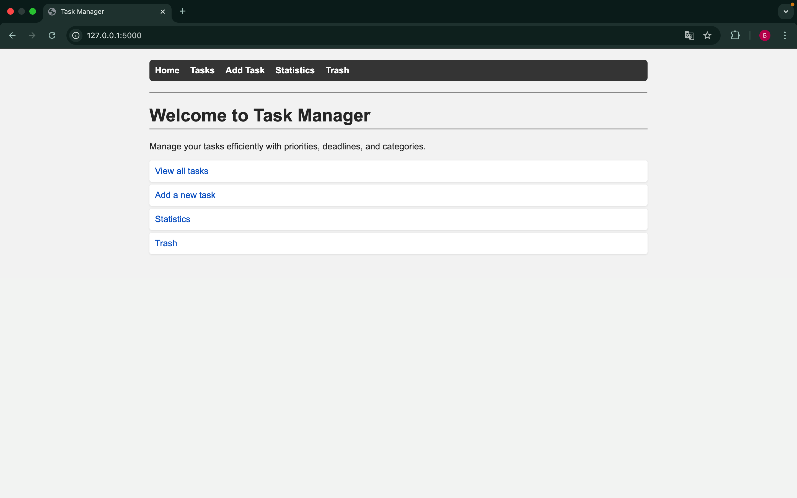
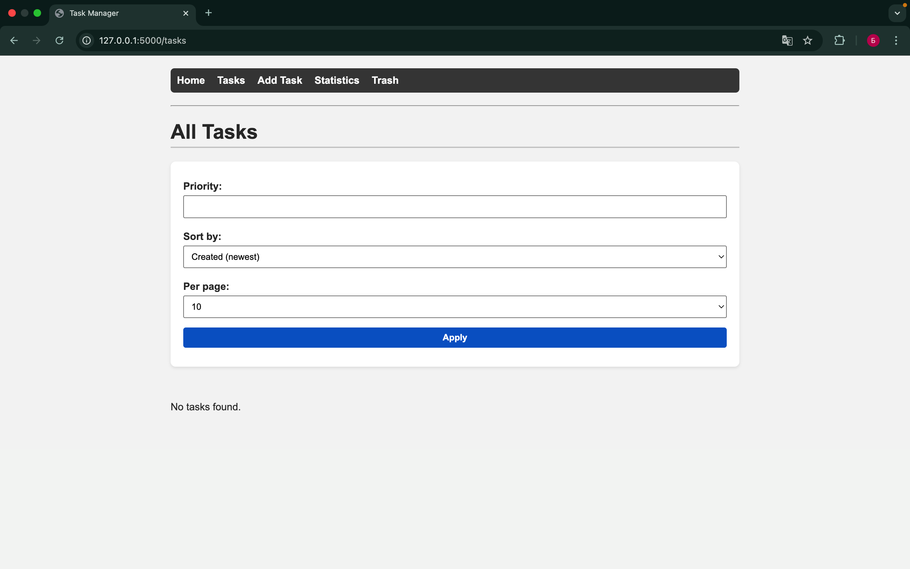
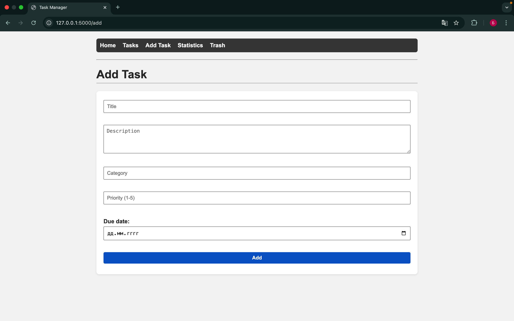
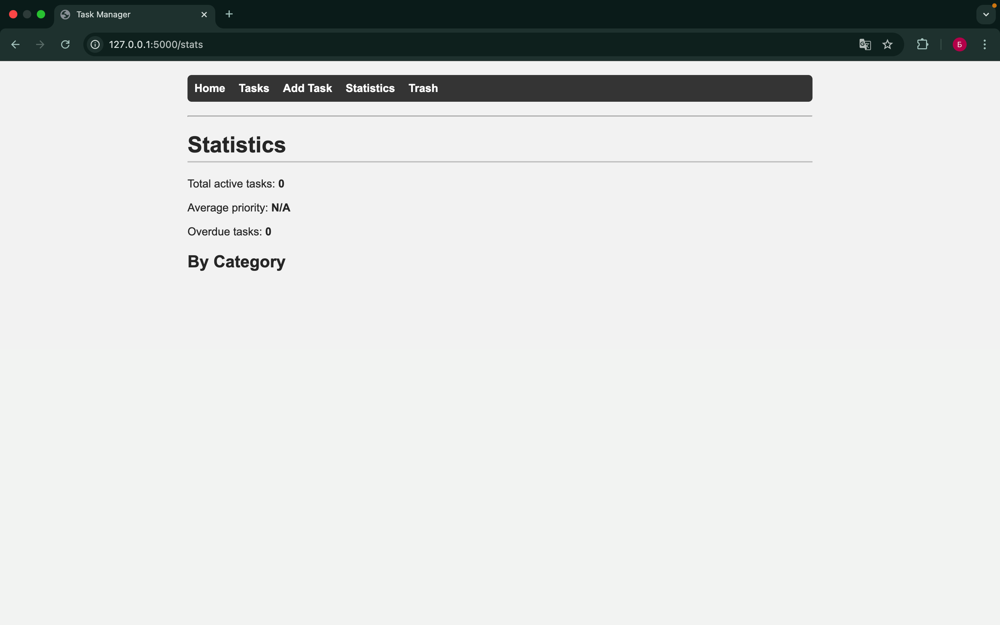
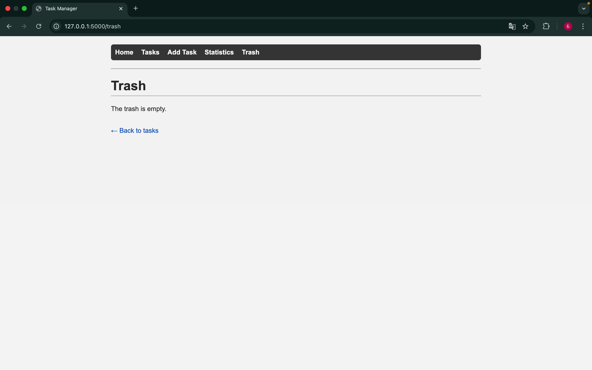
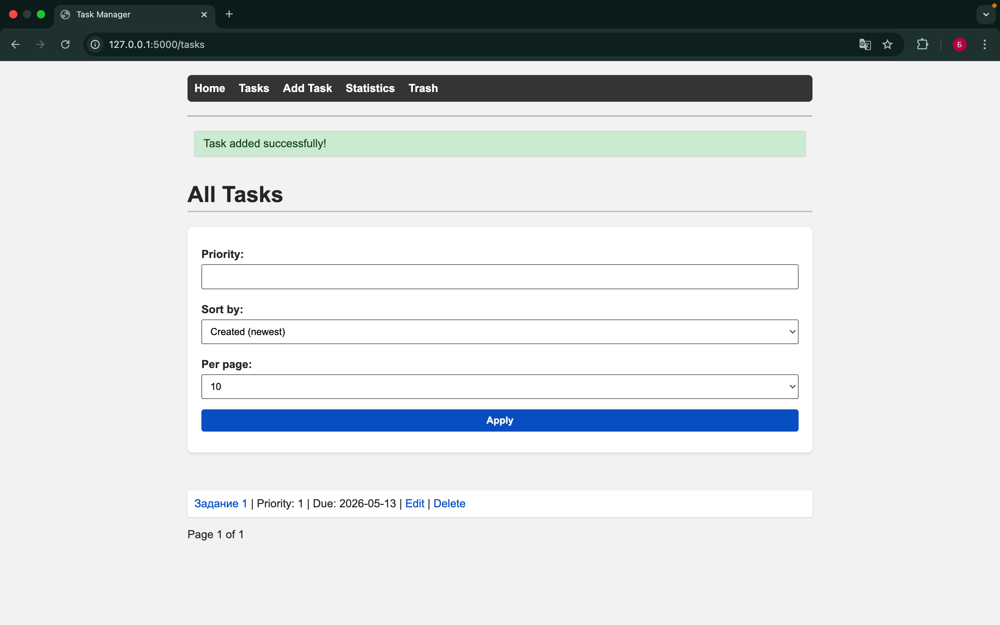
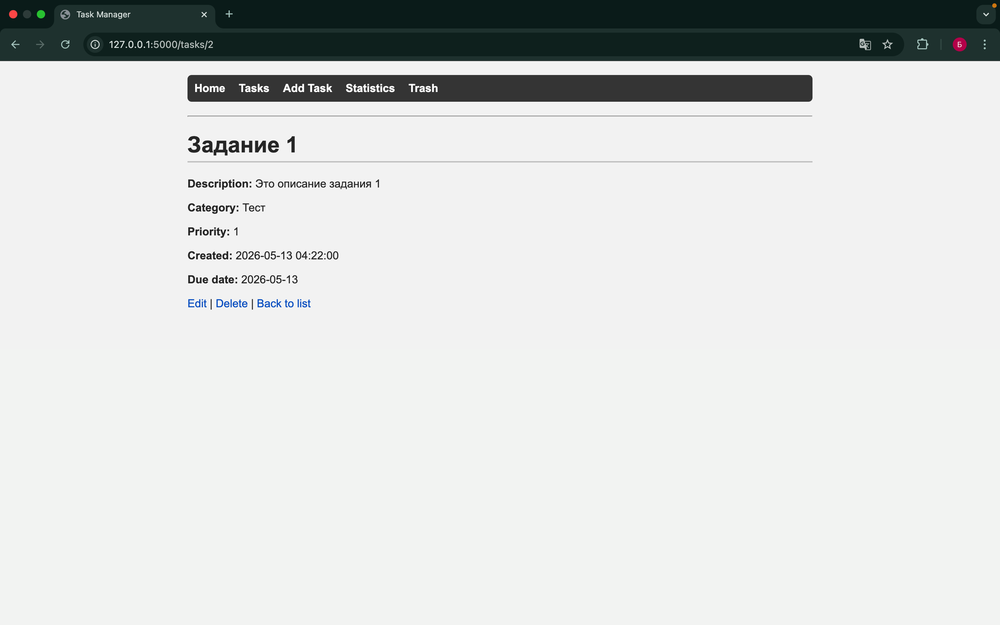
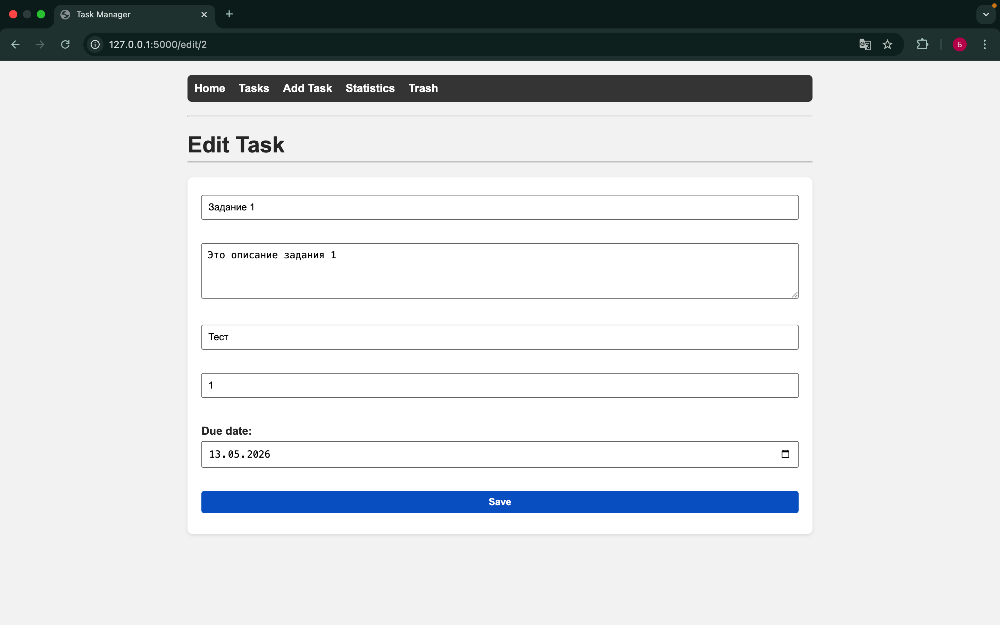
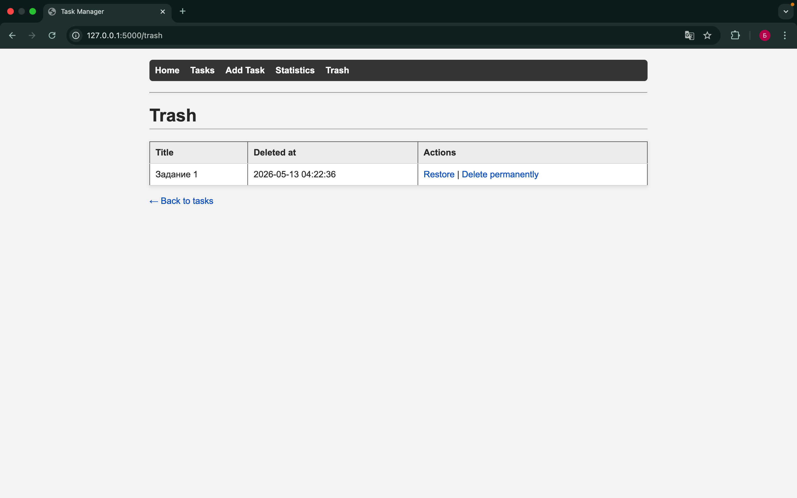

## 1. Введение

Исходный проект «Task Manager» на Flask позволял создавать задачи с полями: название, описание, категория, приоритет и
дата создания. Отсутствовали сроки выполнения, фильтрация, пагинация и архив для мягкого удаления.  
**Цели доработки:**

- Возможность указывать дату выполнения (due date);
- Фильтрация задач по приоритету;
- Постраничная навигация;
- Корзина с восстановлением и окончательным удалением задач;
- Обратная связь через flash-сообщения;
- Аккуратный внешний вид с помощью CSS.

---

## 2. Модель данных и миграция

### 2.1. Новое поле `due_date`

В таблицы `tasks` и `deleted_tasks` добавлен столбец `due_date TEXT`. Он хранит дату в формате `YYYY-MM-DD` (или `NULL`,
если срок не задан).  
Итоговая схема `tasks`:

```sql
CREATE TABLE IF NOT EXISTS tasks
(
    id
    INTEGER
    PRIMARY
    KEY
    AUTOINCREMENT,
    title
    TEXT
    NOT
    NULL,
    description
    TEXT
    NOT
    NULL,
    category
    TEXT
    NOT
    NULL,
    priority
    INTEGER
    NOT
    NULL,
    created_at
    TEXT
    NOT
    NULL,
    due_date
    TEXT
);
```

### 2.2. Автоматическое обновление БД

Так как у пользователей уже могла быть создана таблица без поля `due_date`, функция `init_db()` дополнена кодом
«миграции на лету»:

```python
cursor.execute("PRAGMA table_info(tasks)")
columns = [col[1] for col in cursor.fetchall()]
if 'due_date' not in columns:
    cursor.execute("ALTER TABLE tasks ADD COLUMN due_date TEXT")
```

То же самое сделано для `deleted_tasks`. Это добавляет столбец, не удаляя существующие данные.

---

## 3. Вспомогательная функция `get_tasks_with_filters`

```python
def get_tasks_with_filters(page=1, per_page=10, sort='created_at', priority=None):
```

Она формирует SQL-запрос динамически, соблюдая безопасность:

1. **Фильтр**: если передан `priority` и он корректен, добавляется `WHERE priority = ?`.
2. **Сортировка**: используется словарь допустимых значений, исключающий SQL-инъекцию:
   ```python
   sort_options = {
       'priority': 'priority DESC',
       'created_at': 'created_at DESC',
       'due_date': 'due_date ASC'
   }
   ```
3. **Пагинация**: `LIMIT ? OFFSET ?`, а отдельный COUNT-запрос вычисляет общее число записей.
   Функция возвращает задачи на страницу, общее число страниц и номер текущей страницы.

---

## 4. Основные маршруты и логика

### 4.1. Список задач `/tasks`

Принимает параметры:

- `page`, `per_page`, `sort`, `priority`.
  Валидация гарантирует `page >= 1` и `1 <= per_page <= 50`. Результат получается через `get_tasks_with_filters`.

### 4.2. Добавление и редактирование

- В формах появилось поле `<input type="date">` для `due_date`.
- Серверная проверка: если дата указана, она разбирается через `datetime.strptime`, иначе передаётся `None`.
- Операции сопровождаются flash-сообщениями, например: `flash("Task added successfully!", "success")`.

### 4.3. Мягкое удаление и корзина

- При удалении задача копируется в `deleted_tasks` (теперь вместе с `due_date`), а затем удаляется из основной таблицы.
- `/trash` — список всех удалённых задач.
- `/restore/<deleted_id>` — копирует запись обратно в `tasks` и удаляет из архива.
- `/delete-permanent/<deleted_id>` — необратимо удаляет из архива.

### 4.4. Статистика

- Добавлен подсчёт просроченных задач с помощью SQL-функции `date()` и сравнения с текущей датой.
- Просроченными считаются задачи, у которых `due_date` установлен и меньше сегодняшнего дня.

---

## 5. Шаблоны и интерфейс

Все страницы наследуют `base.html` с навигацией и блоком flash-сообщений.

- **`tasks.html`**:
    - Форма с выбором приоритета, сортировки и количества элементов на странице.
    - Отображение дедлайна: «Due: 2025-06-01» или «No deadline».
    - Ссылки пагинации «← Previous» / «Next →» сохраняют текущие фильтры.

- **`trash.html`**:
    - Таблица с датой удаления и действиями «Restore» / «Delete permanently».
    - При окончательном удалении показывается подтверждение `confirm()`.

- **`task_detail.html`** — полная информация о задаче с дедлайном.
- **`stats.html`** — общая статистика плюс количество просроченных задач.

Код шаблонов использует `url_for()` для генерации ссылок и корректно передаёт параметры фильтрации.

---

## 6. Стилизация

Файл `static/style.css` даёт чистый и современный вид:

- Максимальная ширина контента 900px, отцентрирована.
- Навигационное меню с тёмным фоном.
- Цветные flash-сообщения (зелёный для успеха, красный для ошибок и т.д.).
- Формы с белым фоном, тенью и широкими полями.
- Таблицы и списки с мягкими границами и отступами.

Это улучшает восприятие без использования тяжёлых CSS-фреймворков.

---

## 7. Пример использования

1. Пользователь заходит на главную, переходит в «Add Task» и создаёт задачу «Подготовить отчёт» с дедлайном 15.06.2025,
   категорией «Работа», приоритетом 5.
2. После добавления видит подтверждение «Task added successfully!» и возвращается к списку.
3. В списке задач видит запись с дедлайном, может отфильтровать только задачи с приоритетом 5 или отсортировать по
   сроку.
4. Если задача становится неактуальной, он удаляет её – она попадает в корзину.
5. В корзине задачу можно восстановить или окончательно стереть.
6. На странице статистики он видит общее количество задач, средний приоритет и число просроченных.

## 8. Скриншоты










